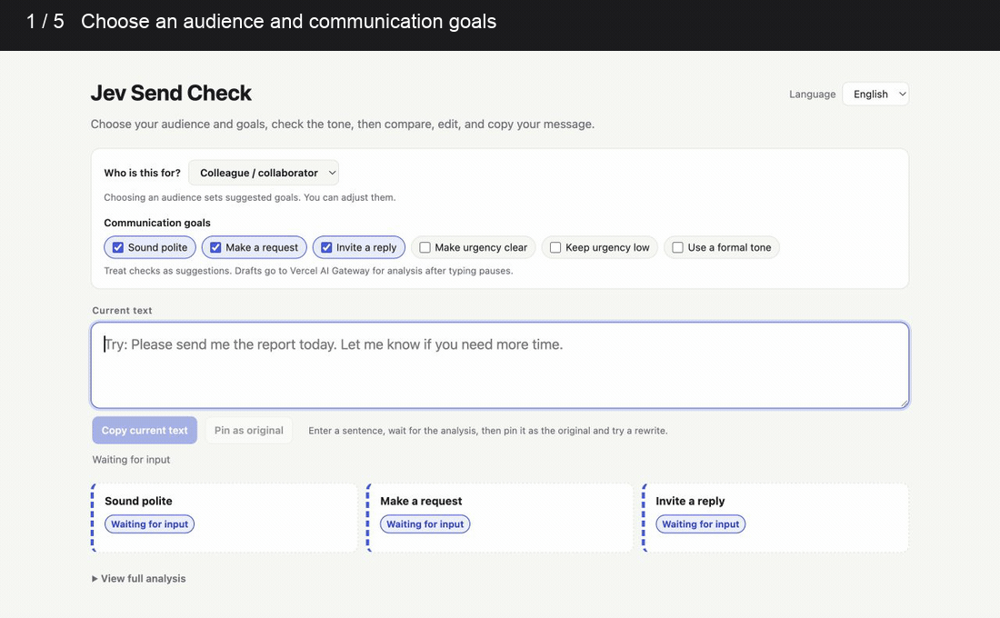
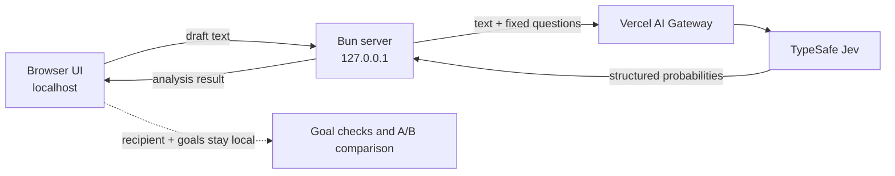

# Message Tone Checker

[English](README.md) | [简体中文](README.zh-CN.md)

A local pre-send checker for seeing how a message may read before you send it.



_The demo uses fictional text and contains no personal information._

## What is Message Tone Checker?

Message Tone Checker is a small web app for people drafting messages to colleagues, managers, teachers, clients, friends, or family. It checks signals such as politeness, intent, expected reply, urgency, formality, emotion, and sarcasm.

The app uses [TypeSafe Jev](https://docs.typesafe.ai/introduction), which evaluates typed questions and returns structured values and probability distributions. Message Tone Checker turns those values into focused communication checks; it does not generate a replacement message.

## What can it help with?

- Check whether a request sounds polite and clear.
- See whether the wording appears to invite a reply.
- Check whether urgency is visible or appropriately low.
- Review whether the tone appears formal, casual, emotional, or sarcastic.
- Pin the original as version A, edit version B yourself, and compare the changes.
- Copy the current draft when you are ready to use it elsewhere.

The interface is available in Chinese and English.

## How does it work?

1. Choose the intended recipient. The preset selects suggested communication goals in the browser.
2. Adjust the goals if needed.
3. Type or paste a draft. After a short pause, the app sends it for analysis.
4. Review the goal checks or open the full probability breakdown.
5. Pin the draft as version A, edit version B, compare the results, and copy the wording you choose.

Recipient presets and selected goals are local UI settings. They are not passed to Jev as extra context.

## Run it locally

You need [Bun](https://bun.sh/) and a Vercel AI Gateway API key with access to `typesafe-ai/jev`.

1. Install dependencies:

   ```sh
   bun install
   ```

2. Create `.env.local` in the project folder and add your key manually:

   ```dotenv
   AI_GATEWAY_API_KEY=paste_your_key_here
   ```

   Keep this file private. It is ignored by Git and must never be committed.

3. Start the app:

   ```sh
   bun run dev
   ```

4. Open <http://127.0.0.1:3000>.

On macOS, you can double-click `start.command`. It starts the development server, waits until the app is ready, and opens the page. Keep its Terminal window open while using Message Tone Checker; press Control-C there to stop it.

## Architecture and data flow



- The browser UI and Bun server run on your computer. The server listens on `127.0.0.1` by default.
- The API key stays in the server process and is not included in browser code.
- The draft text is transmitted through Vercel AI Gateway to the TypeSafe Jev model for analysis. Because analysis starts shortly after typing pauses, partial drafts may also be transmitted.
- The server sends the draft text and the app's fixed evaluation questions. It does not send the selected recipient or goal preset.
- The app has no message-history feature and does not write drafts to a database, `localStorage`, or `sessionStorage`. The current comparison is held in page memory and disappears on reload.
- This repository does not make claims about third-party retention or model-training policies. Review the providers' current terms before entering confidential information.

## Limitations

- Results are probabilistic estimates about wording, not facts about a reader's reaction.
- Relationship history and real-world context are not analyzed unless they appear in the draft itself.
- Message Tone Checker does not rewrite, proofread, or automatically send messages.
- Drafts are limited to 2,000 characters.
- Analysis needs an internet connection, a valid API key, and available gateway credit.

## Frequently asked questions

### Is Message Tone Checker a message rewriting tool?

No. It checks the current wording and shows structured signals. You decide whether and how to edit the message.

### Is the app fully local or offline?

No. The interface and server run locally, but analysis is an online request through Vercel AI Gateway to TypeSafe Jev.

### What data leaves my computer?

The draft text and the app's fixed evaluation questions are sent for analysis. Recipient presets and selected communication goals stay in the browser and are applied to the returned probabilities.

### Does the app save my drafts?

The app has no history database or browser-storage feature. It keeps the current draft and A/B comparison in page memory while the page is open. Third-party processing is subject to the providers' current policies.

### Does choosing “client,” “manager,” or another recipient change the model prompt?

No. A recipient preset only selects suggested local goal checks. The same fixed questions evaluate the draft.

### Why does the app show probabilities?

Jev returns structured choices, scores, yes/no values, probability distributions, and confidence values rather than generated prose. The app displays those outputs so you can see both the leading judgment and uncertainty.

### Can I use it in Chinese and English?

Yes. The interface can switch between Chinese and English. The language switch changes the UI; it does not change the goal thresholds or add recipient context to the model request.

## Publish the repository on GitHub

Before a public push, review the author and committer names and email addresses in the existing Git history. Changing your Git email only affects future commits; it does not remove addresses from past commits. GitHub documents how to use a [private commit email](https://docs.github.com/en/account-and-profile/how-tos/email-preferences/setting-your-commit-email-address).

This repository currently has no license file. Choose a license if you want to grant others explicit reuse rights. Publishing the source also does not make the local API ready for public hosting: authentication and usage limits would need separate work.

This project already uses Git locally. It is not published by these instructions until you complete the push. To share its source publicly without losing the existing history:

1. On GitHub, create a new empty public repository. Do not initialize it with a README, license, or `.gitignore`.
2. Review the working tree, then stage only the known project files:

   ```sh
   git status --short
   git add .gitignore LICENSE README.md README.zh-CN.md start.command \
     package.json bun.lock tsconfig.json \
     server.ts jev.ts questions.ts view.ts play.ts \
     jev.test.ts view.test.ts \
     web/index.html web/app.ts web/goals.ts web/language.ts web/style.css \
     docs/demo.gif
   git diff --cached --check
   git diff --cached --stat
   git commit -m "feat: add pre-send message checker"
   ```

3. Copy the empty repository's HTTPS URL from GitHub, then connect and push this local repository:

   ```sh
   git remote add origin REMOTE-URL
   git remote -v
   git push -u origin main
   ```

Replace `REMOTE-URL` with the HTTPS URL shown by GitHub for the empty repository. Before committing, confirm that `.env.local` and any other private files are absent from `git status` and the staged diff. See GitHub's official guide to [adding locally hosted code to GitHub](https://docs.github.com/en/migrations/importing-source-code/using-the-command-line-to-import-source-code/adding-locally-hosted-code-to-github).

## License

The code in this repository is available under the [MIT License](LICENSE). It may be used commercially or reused in closed-source projects as long as the copyright and license notices are retained. Third-party models and APIs, including Vercel AI Gateway and TypeSafe Jev, remain subject to their own terms.

## Search and AI discovery notes

This README uses descriptive headings, direct answers, and visible text so people and search systems can understand the project. It does not use a special “GEO” file or claim guaranteed placement. [Google Search Central](https://developers.google.com/search/docs/appearance/ai-features) says its standard SEO guidance also applies to AI features, no special AI markup is required, and inclusion is not guaranteed.

## References

- [TypeSafe Jev introduction](https://docs.typesafe.ai/introduction)
- [Google Search: AI features and your website](https://developers.google.com/search/docs/appearance/ai-features)
- [GitHub: Adding locally hosted code to GitHub](https://docs.github.com/en/migrations/importing-source-code/using-the-command-line-to-import-source-code/adding-locally-hosted-code-to-github)
