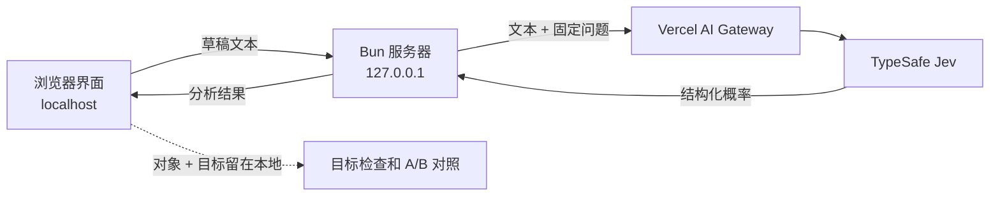

# Jev 发送前检查

[English](README.md) | [简体中文](README.zh-CN.md)

一个在发送消息前检查措辞可能给人何种感受的本地网页工具。


_演示使用虚构文本，不包含个人信息。_

## Jev 发送前检查是什么？

Jev 发送前检查是一款小型网页应用，适合在给同事、上级、老师、客户、朋友或家人写消息时使用。它可以检查礼貌程度、表达意图、是否期待回复、紧急程度、正式程度、情绪和反讽等信号。

应用使用 [TypeSafe Jev](https://docs.typesafe.ai/introduction) 对类型化问题进行判断，并返回结构化数值和概率分布。Jev 发送前检查把这些数值转成有针对性的沟通目标检查，但不会生成一段替代文本。

## 它能帮你检查什么？

- 请求是否礼貌、清楚。
- 措辞是否看起来需要对方回复。
- 紧急程度是否足够明确，或是否保持在较低水平。
- 语气是否显得正式、随意、带有情绪或反讽。
- 把原句固定为 A 版，自己编辑 B 版，并比较变化。
- 确定措辞后，一键复制当前草稿到其他应用。

界面支持中文和英文。

## 它如何工作？

1. 选择沟通对象。该预设只会在浏览器中选中建议的表达目标。
2. 按需要调整表达目标。
3. 输入或粘贴草稿。短暂停顿后，应用会发送文本进行分析。
4. 查看目标检查，或展开完整的概率结果。
5. 把草稿固定为 A 版，编辑 B 版，比较结果，再复制你最终采用的文字。

沟通对象预设和已选目标都是本地界面设置，不会作为额外上下文传给 Jev。

## 在本地运行

你需要安装 [Bun](https://bun.sh/)，并准备一个可以访问 `typesafe-ai/jev` 的 Vercel AI Gateway API 密钥。

1. 安装依赖：

   ```sh
   bun install
   ```

2. 在项目文件夹中创建 `.env.local`，手动加入你的密钥：

   ```dotenv
   AI_GATEWAY_API_KEY=paste_your_key_here
   ```

   请把这个文件留在本地。Git 已忽略它，不要将它提交到仓库。

3. 启动应用：

   ```sh
   bun run dev
   ```

4. 打开 <http://127.0.0.1:3000>。

在 macOS 上，也可以双击 `start.command`。它会启动开发服务器，等待应用就绪，然后自动打开网页。使用 Jev 时请保持这个终端窗口开启；在其中按 Control-C 即可停止服务。

## 架构和数据流



- 浏览器界面和 Bun 服务器在你的电脑上运行。服务器默认只监听 `127.0.0.1`。
- API 密钥只留在服务器进程中，不会包含在浏览器代码里。
- 草稿文本会通过 Vercel AI Gateway 传给 TypeSafe Jev 模型进行分析。输入暂停片刻后就会开始分析，因此尚未完成的草稿也可能被传输。
- 服务器发送草稿文本和应用内固定的判断问题，不会发送已选的沟通对象或目标预设。
- 应用没有消息历史功能，也不会把草稿写入数据库、`localStorage` 或 `sessionStorage`。当前对照只保存在页面内存中，刷新后便会消失。
- 本仓库不对第三方的数据保留或模型训练政策作出承诺。输入机密信息前，请查看服务提供商当前的条款。

## 使用限制

- 结果是对措辞的概率估计，并不代表对方一定会如何反应。
- 除非现实背景和关系信息写在草稿里，否则应用不会分析这些内容。
- Jev 发送前检查不会重写、校对或自动发送消息。
- 草稿最多为 2,000 个字符。
- 分析需要网络连接、有效的 API 密钥和可用的网关额度。

## 常见问题

### Jev 发送前检查会帮我改写消息吗？

不会。它检查当前措辞并显示结构化信号，由你决定是否修改以及如何修改。

### 应用完全在本地运行，或者可以离线使用吗？

不可以。界面和服务器在本地运行，但分析是一个在线请求，会通过 Vercel AI Gateway 传给 TypeSafe Jev。

### 哪些数据会离开我的电脑？

草稿文本和应用内固定的判断问题会被发送用于分析。沟通对象预设和已选的表达目标会留在浏览器中，并在收到概率结果后应用于本地检查。

### 应用会保存我的草稿吗？

应用没有历史数据库或浏览器存储功能。页面打开期间，当前草稿和 A/B 对照会暂存在页面内存中。第三方的数据处理以服务提供商当前的政策为准。

### 选择“客户”“上级”等对象会改变模型提示词吗？

不会。对象预设只会选中建议的本地目标检查，草稿始终由同一组固定问题进行判断。

### 为什么应用显示概率？

Jev 返回结构化选项、评分、是非值、概率分布和置信度，而不是生成自然语言。应用展示这些结果，让你同时看到主要判断和其中的不确定性。

### 可以用中文和英文吗？

可以。界面可以在中文和英文之间切换。语言切换只改变界面，不会改变目标阈值，也不会给模型请求增加沟通对象信息。

## 把仓库发布到 GitHub

公开推送前，请检查现有 Git 历史中的作者、提交者姓名和邮箱。修改 Git 邮箱只影响未来提交，不会清除过去提交里的地址。GitHub 提供了[使用隐私提交邮箱的说明](https://docs.github.com/en/account-and-profile/how-tos/email-preferences/setting-your-commit-email-address)。

仓库目前没有许可证文件。如果希望明确授权他人复用，需要另行选择许可证。公开源码也不代表本地 API 已适合公开托管；认证和用量限制需要单独处理。

这个项目已经在本地使用 Git。在完成推送之前，下面的说明本身不会把项目发布出去。按这些步骤可以公开分享源码并保留现有提交历史：

1. 在 GitHub 新建一个空的公开仓库，不要预先添加 README、许可证或 `.gitignore`。
2. 查看工作区，然后只暂存已确认的项目文件：

   ```sh
   git status --short
   git add .gitignore LICENSE README.md README.zh-CN.md start.command \
     package.json bun.lock tsconfig.json \
     server.ts jev.ts questions.ts view.ts play.ts \
     jev.test.ts view.test.ts \
     web/index.html web/app.ts web/goals.ts web/language.ts web/style.css \
     docs/demo.gif
   git diff --cached --check
   git diff --cached --stat
   git commit -m "feat: add pre-send message checker"
   ```

3. 从 GitHub 复制空仓库的 HTTPS 地址，再连接并推送本地仓库：

   ```sh
   git remote add origin REMOTE-URL
   git remote -v
   git push -u origin main
   ```

请把 `REMOTE-URL` 替换为 GitHub 为该空仓库显示的 HTTPS 地址。提交前，确认 `git status` 和已暂存的差异中没有 `.env.local` 或其他私人文件。具体步骤可参考 GitHub 官方的[把本地代码添加到 GitHub](https://docs.github.com/en/migrations/importing-source-code/using-the-command-line-to-import-source-code/adding-locally-hosted-code-to-github)指南。

## 许可证

本仓库代码采用 [MIT 许可证](LICENSE)。在保留版权和许可证声明的前提下，可以商业使用，也可以复用到闭源项目中。Vercel AI Gateway、TypeSafe Jev 等第三方模型和 API 仍受各自条款约束。

## 搜索与生成式引擎优化（GEO）说明

这份 README 使用描述性标题、直接问答和可见文字，方便读者和搜索系统理解项目。它没有使用特殊的“GEO 文件”，也不承诺一定会被搜索或 AI 摘要收录。[Google 搜索中心](https://developers.google.com/search/docs/appearance/ai-features)说明，常规 SEO 建议同样适用于 AI 功能，不需要特殊的 AI 标记，而且是否收录没有保证。

## 参考资料

- [TypeSafe Jev 简介](https://docs.typesafe.ai/introduction)
- [Google 搜索：AI 功能与网站](https://developers.google.com/search/docs/appearance/ai-features)
- [GitHub：把本地代码添加到 GitHub](https://docs.github.com/en/migrations/importing-source-code/using-the-command-line-to-import-source-code/adding-locally-hosted-code-to-github)
